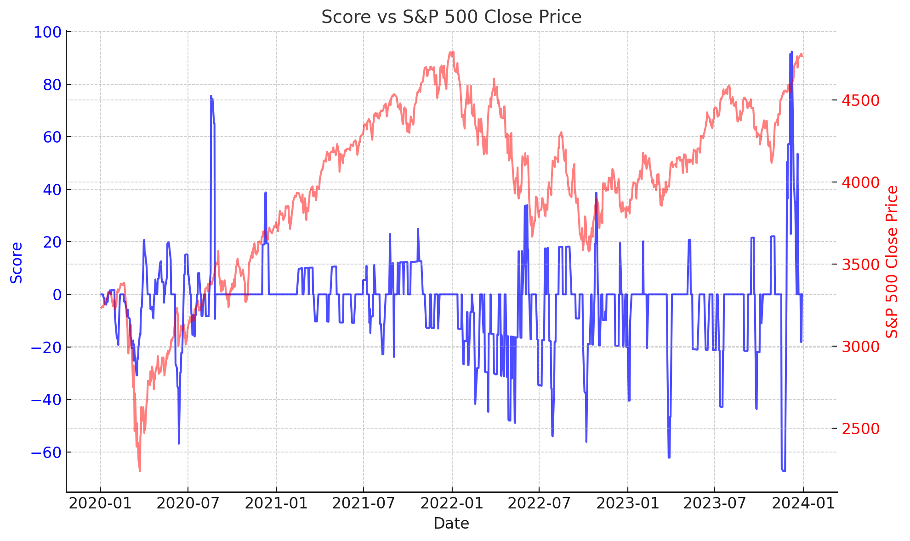

# 📊 DDEFI 2025 - Analyse de Sentiment et Prédiction du S&P 500 📈 - TrendX

## 🔍 Contexte

Dans un marché financier en constante évolution, comprendre le sentiment des investisseurs est crucial pour affiner la précision des modèles prédictifs.
Ce projet a pour but de créer un indice Fear & Greed basé sur des sources variées (actualités, Reddit, Google Trends, etc.) et de l’intégrer dans un modèle Machine Learning pour améliorer les prévisions du S&P 500.
Cet indice a pour but de prévoir des mouvements de retournements potentiels du marché. En effet, une peur extrême indique souvent une sous-évaluation des actifs et donc des opportunités d'achat. Au contraire, une cupidité excessive suggère un marché suracheté et donc un potentiel retournement baissier. 

💼 À qui s'adresse TrendX ?

📌 Fonds d’investissement & Hedge Funds – Pour affiner leurs stratégies basées sur l'analyse de sentiment  
📌 Traders indépendants & Analystes – Pour anticiper les tendances du S&P 500 grâce à l’IA  
📌 Startups Fintech – Pour intégrer un indice Fear & Greed intelligent dans leurs solutions  

---

🎯 Objectifs du Projet

✅ Développer un indice Fear & Greed personnalisé à partir de données d'actualités et de médias sociaux

✅ Tester l’impact de cet indice sur la précision des modèles de prédiction du S&P 500

✅ Automatiser la collecte et l’analyse des données à l’aide d’APIs et de pipelines de données

✅ Industrialiser la solution via CI/CD, Docker, et Cloud Deployment

---

## 📌 1. Sources de Données

📈 Données du marché  

YahooFinance API : Données historiques du S&P 500    
Macroéconomie : Indicateurs FRED API (inflation, taux d’intérêt, chômage)  

📢 Données de sentiment
 
Actualités financières : Récupération via GDELT API  ==> récupération de titres d'articles liés à l'actualité financière.       
Google Trends API : Volume de recherche pour des termes financiers    
Twitter API (si possible) : Extraction des tweets mentionnant le S&P 500, bloqués malheureusement il fallait payer pour    
collecter les données.   
Reddit API : Extraction des discussions financières sur r/wallstreetbets   

📌 2. Extraction & Prétraitement des Données

📥 Collecte

Web Scraping pour récupérer des articles de presse ==> mots-clés : " S&P 500 " pour collecter les articles pouvant influencer son prix
[Télécharger le fichier Excel](SP500_Fear_Greed_Articles_finale.xlsx)
Récupération uniquement des titres des articles et leurs liens url.    
Nettoyage des textes avec NLP (suppression des stopwords, stemming, lemmatisation)    

⚠️ Difficultés survenues : Collecte de nombreux tweets sur Reddit mais unqiuement les plus récents et donc impossible pour tester avec du Machine learning afin de prédire le prix. On pouvait récupérer que les 2 derniers jours.  

📊 Feature Engineering

Analyse de sentiment NLP : Scoring des titres d'articles pour créer notre index   
Agrégation hebdomadaire du score Fear & Greed  
Fusion avec les données du S&P 500 📥 [Télécharger le fichier Excel](https://github.com/votre-repo/votre-projet/blob/main/fichier.xlsx)
pour créer un dataset prêt à être modélisé.
Visualisation du prix du S&P500 avec le scoring créé.

  

📌 3. Modélisation Machine Learning

🛠️ Modèles testés :

✅ XGBoost (modèle performant pour les séries temporelles)  
 
🎯 Évaluation des modèles

Backtest sur des périodes historiques pour mesurer la fiabilité :    

On a d'abord essayé de corréler les log des rendements du S&P500 et le scoring sur 7 jours de nos titres d'articles afin d'entraîner notre modèle. XGBoost a donc construit des prédictions de baisse ou de hausse du S&P500 en se basant sur le passé. On a fait du 70-30. 

Comparaison des performances avec et sans l’indice Fear & Greed  

Visualisation des prédictions avec Matplotlib & Seaborn  

📌 4. Déploiement et Conlusion

🚀 Automatisation
✅ Pipeline de collecte et transformation des données (ETL)
✅ Mise à jour quotidienne des prédictions

📊 Résultats et Insights
📌 Corrélation entre le sentiment et le S&P 500
📌 Amélioration de la précision du modèle avec l’analyse de sentiment
📌 Détection de retournements de marché basés sur Fear & Greed
