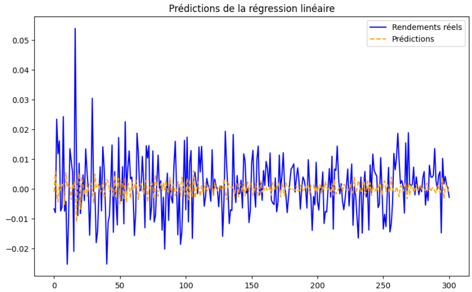
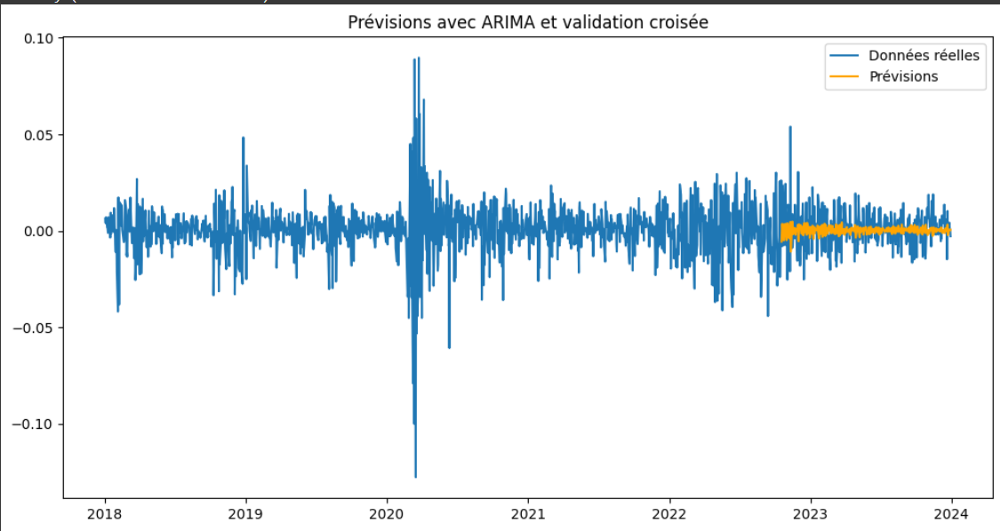

# Prédiction des Prix et Actifs du S&P 500 avec Machine Learning

## Contexte
Ce projet vise à prédire les prix et rendements des actifs du S&P 500 en utilisant des modèles de machine learning. Le projet applique des techniques avancées d'analyse de séries temporelles, de modélisation prédictive et d'évaluation des performances. 

## Objectifs
1. Collecter et préparer les données financières (prix historiques, indicateurs macroéconomiques).
2. Développer des modèles prédictifs en utilisant plusieurs algorithmes.
3. Évaluer les performances des modèles avec des métriques standards.
4. Interpréter les résultats pour proposer des recommandations d'investissement.

---

## Structure du projet

### 1. Collecte et Préparation des Données
- **Source des données :** Yahoo Finance (données historiques sur 5 ans).
Voici l'excel où est stocké la récupération des données. Nous avons pris sur 6 ans afin d'avoir les données nécessaires pour réaliser les différents indicateurs se basant sur les données historiques comme le MACD, SMA_50 et SMA_100 :
[📊 Télécharger le fichier Excel des résultats](https://github.com/username/repo/raw/main/resultats.xlsx)
  
- **Étapes réalisées :**
  
  - Nettoyage des données (gestion des valeurs manquantes et des doublons).
  - Transformation des prix en rendements logarithmiques.
    Voici l'excel où les données on été néttoyées et les prix en rendements logarithmiques :
[📊 Télécharger le fichier Excel des résultats](https://view.officeapps.live.com/op/view.aspx?src=https%3A%2F%2Fraw.githubusercontent.com%2FManonlks5%2FPROJET_DDEFI_2025%2Frefs%2Fheads%2Fmain%2Fsp500_cleaned%2520(3).xlsx&wdOrigin=BROWSELINK)
  
  - Analyse de stationnarité avec le test ADF.(cf voir le code pyhton)
    Résultats du test ADF :
      - Test Statistic: -11.853423740881892. Cette valeur négative indique que la série des Log Returns a
  une forte tendance a être stationnaire. 
      - P-Value: 7.119616583190098e-22. P-value très faible car <0,05 indique que nous pouvons rejeter l'hypothèse nulle H0. 
      - La série est stationnaire.
  
  - Création d'indicateurs techniques (Moyennes mobiles, RSI, MACD).
    Voici l'excel avec tous les différents indicateurs que nous avons créés.
    [📊 Télécharger le fichier Excel des résultats](https://view.officeapps.live.com/op/view.aspx?src=https%3A%2F%2Fraw.githubusercontent.com%2FManonlks5%2FPROJET_DDEFI_2025%2Frefs%2Fheads%2Fmain%2Fs%2526p500_with_indicators_2019%2520(1).xlsx&wdOrigin=BROWSELINK)

    
     - De plus, voici la matrice de corrélation entre les différents indicateurs :
    

    - Enfin nous avons créé un nouveau excel avec les features sélectionnées :
     [📊 Télécharger le fichier Excel des résultats](https://view.officeapps.live.com/op/view.aspx?src=https%3A%2F%2Fraw.githubusercontent.com%2FManonlks5%2FPROJET_DDEFI_2025%2Frefs%2Fheads%2Fmain%2Fs%2526p500_selected_features_2019%2520(1).xlsx&wdOrigin=BROWSELINK)
  
### 2. Modèles Implémentés
#### Modèle 1 : Régression Linéaire
- **Description :** Modèle simple pour prédire les rendements en fonction des indicateurs techniques.
- **Résultats :**
  - **MAE :** 0.0076
  - **RMSE :** 0.0099
- **Visualisation :**
  
 

#### Modèle 2 : ARIMA
- **Description :** Modèle ARIMA pour capturer les dépendances temporelles des séries stationnaires.
- **Ordre optimal :** (1, 1, 1) (après validation croisée).
- **Résultats :**
  - **MAE :** 0.0076
  - **RMSE :** 0.0099
  - **Précision directionnelle :** 46.36%
- **Visualisation :**
 

### 3. Méthodologie
#### Entraînement et Validation
- **Partitionnement :** Données divisées en 80% pour l'entraînement et 20% pour le test.
- **Validation croisée :** Validation par fenêtre glissante (rolling window).

#### Évaluation
- **Métriques utilisées :**
  - MAE (Mean Absolute Error)
  - RMSE (Root Mean Squared Error)
  - Précision directionnelle (hausse/baisse)

### 4. Analyse des Résultats
# Analyse des Performances des Modèles de Prédiction des Rendements

Ce projet évalue la performance de deux modèles de prédiction des rendements financiers : la Régression Linéaire et ARIMA. L'objectif est de comparer leurs performances à l'aide de métriques comme la MAE et le RMSE, tout en discutant des erreurs courantes et des pistes d'amélioration.

## 1. Analyse des Performances

### Comparaison des Modèles

#### Modèle 1 : Régression Linéaire
- **MAE** : 0.0076
- **RMSE** : 0.0099  
  L'erreur absolue moyenne (MAE) et l'erreur quadratique moyenne (RMSE) montrent une performance stable. Cependant, la régression linéaire a du mal à capter les variations extrêmes des rendements.

#### Modèle 2 : ARIMA
- **MAE** : 0.0076
- **RMSE** : 0.0099  
  L'ARIMA génère des prévisions plus lissées et présente une précision directionnelle limitée à 46.36 %. Il est plus adapté pour des prévisions moyennes que pour capturer les fluctuations rapides.

### Interprétation des Résultats

Les graphiques suivants montrent que :
- Les modèles reproduisent correctement les tendances générales des rendements.
- Les erreurs sont plus prononcées lors des pics ou des retournements brusques.

#### Visualisation
- **Répartition des erreurs des deux modèles**.
- **Superposition des prédictions avec les données réelles**. *(Insérez des graphiques ici)*

## 2. Discussion sur les Erreurs Courantes

### Sources Potentielles d'Erreur

- **Surajustement** : Les modèles peuvent avoir surappris les données d'entraînement, particulièrement l'ARIMA si l'ordre (p, d, q) n'est pas optimisé pour une bonne généralisation.
- **Multicolinéarité** : Dans la régression linéaire, des variables explicatives fortement corrélées peuvent fausser les coefficients des variables.
- **Endogénéité** : La dépendance des variables explicatives aux valeurs futures des rendements peut biaiser les résultats.

### Pistes d'Amélioration

- **Réduction du surajustement** : Augmenter la taille des données ou utiliser des techniques de régularisation (par exemple, Ridge ou Lasso pour la régression linéaire).
- **Gestion de la multicolinéarité** : Effectuer une sélection préalable des variables via une analyse de corrélation.
- **Capturer les retournements** : Explorer des modèles non linéaires comme les réseaux neuronaux récurrents (RNN) ou des modèles basés sur des arbres comme Random Forest et XGBoost.

## 3. Conclusion et Recommandations

### Principales Conclusions

- Les modèles linéaires simples (Régression Linéaire, ARIMA) offrent une bonne base pour prédire les rendements moyens, mais leur capacité à capturer les retournements rapides reste limitée.
- L'ARIMA génère des prévisions lissées, tandis que la régression linéaire est plus influencée par les pics et fluctuations soudaines.

### Recommandations

#### Stratégies d'Investissement :
- **Basées sur l'ARIMA** : Privilégier des positions à moyen terme pour capter les tendances générales.
- **Basées sur la régression linéaire** : Utiliser les prédictions comme un indicateur secondaire pour confirmer les signaux d'achat/vente générés par d'autres outils.

#### Prochaines Étapes :
- Tester des modèles plus complexes tels que les GARCH pour la volatilité ou des modèles de deep learning.
- Intégrer davantage de données externes (macroéconomiques, sectorielles) pour améliorer la robustesse des prédictions.

